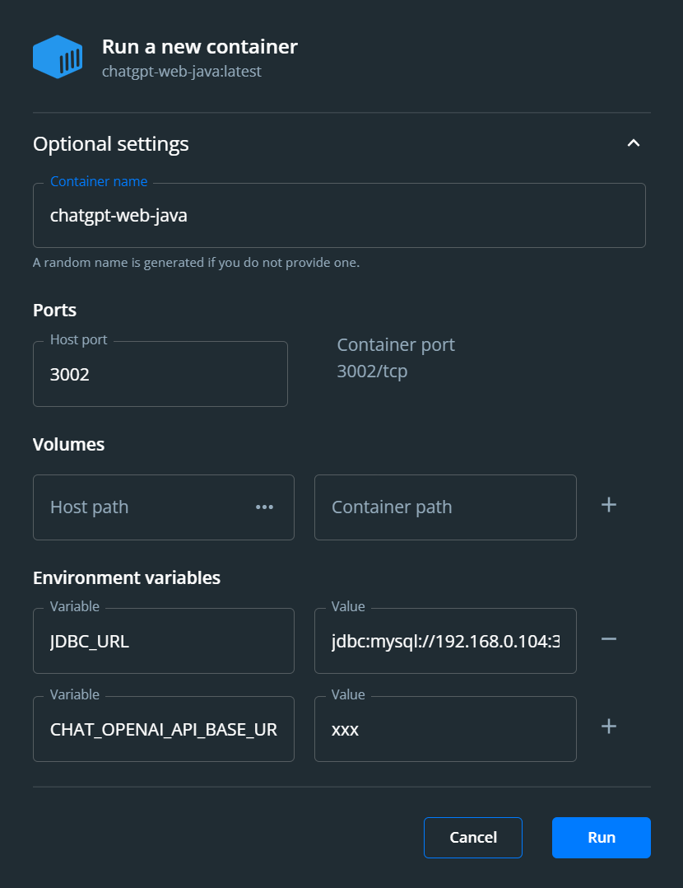

# chatgpt-web-java

# 分支 main

## 介绍 

- [Chanzhaoyu/chatgpt-web](https://github.com/Chanzhaoyu/chatgpt-web) 项目的 Java 后台
- 该分支关联项目的 [2.10.8](https://github.com/Chanzhaoyu/chatgpt-web/releases/tag/v2.10.8) 版本，在不改动前端的情况下更新后台

## 框架

- Spring Boot 2.7.10
- JDK 17
- SpringDoc 接口文档
- MyBatis Plus
- MapStruct
- Lombok
- [Hutool](https://hutool.cn/) 
- [SaToken](https://sa-token.cc/) 权限校验
- [Grt1228 ChatGPT java sdk](https://github.com/Grt1228/chatgpt-java)

## 已实现功能

### 上下文聊天

通过 MySQL 实现聊天数据存储来实现 apiKey 方式的上下文聊天，AccessToken 默认支持上下文聊天。

数据库存储了每次聊天对话的记录，在选择上下文聊天时，通过 parentMessageId 往上递归遍历获取历史消息，将历史问题以及回答消息都发送给 GPT。

### 聊天记录存储

- 存在 MySQL
- SQL 存放在 resources 的 db 目录

### 敏感词过滤

在项目启动时会将敏感词文件 sensitive_word_base64.txt 的数据导入到敏感词表，目前还未提供后台管理敏感词的接口，提供后这种方式可以去掉。在文件中敏感词以 base64 形式存放。并将敏感词表的数据构建到 HuTool 提供的 WordTree 类中。在发送消息调用方法判断是否属于敏感词，是的话消息发送不成功。为了兼容前端保持上下文关系，在消息内容属于敏感词的情况下会正常返回消息格式，但是带的是请求的的 conversationI 和 parentMessagId。


### ip 限流

基于内存和双端队列实现滑动窗口限流，在配置文件中配置 maxRequest 和 maxRequestSecond。


## 待实现功能

- GPT 接口异常信息特定封装返回

## 存在问题

- 在接口返回报错信息时，不会携带 conversationid 和 parentMessageId，导致前端下一次发送消息时会丢失这两个字段，丢失上下文关系。

## 接口

| 路径          | 功能         | 完成情况 |
| ------------- | ------------ | -------- |
| /config       | 获取聊天配置 | 已完成   |
| /chat-process | 消息处理     | 已完成   |
| /verify       | 校验密码     | 已完成   |
| /session      | 获取模型信息 | 已完成   |

## 地址

- 接口文档：http://localhost:3002/swagger-ui.html

## 运行

- IDEA、Dockfile

- application.yml

  ```yaml
  spring:
    datasource:
      driver-class-name: com.mysql.cj.jdbc.Driver
      username: root
      password: 123456
      url: jdbc:mysql://localhost:3309/chat?useUnicode=true&characterEncoding=utf8&serverTimezone=GMT%2B8&useSSL=false
  
  #mybatis-plus:
  #  configuration:
      # 控制台打印 SQL
  #    log-impl: org.apache.ibatis.logging.stdout.StdOutImpl
  
  chat:
    # 访问密码
    auth_secret_key: 123456
    # OpenAI API Key - https://platform.openai.com/overview
    openai_api_key: xxx
    # change this to an `accessToken` extracted from the ChatGPT site's `https://chat.openai.com/api/auth/session` response
    openai_access_token: xxx
    # OpenAI API Base URL - https://api.openai.com/，要加/后缀
    openai_api_base_url: https://api.openai.com/
    # API Model - https://platform.openai.com/docs/models apiKey 和 AccessToken mode 不一样
    openai_api_model:
    # 反向代理地址 AccessToken 时使用
    api_reverse_proxy: https://bypass.duti.tech/api/conversation
    # 超时毫秒
    timeout_ms: 100000
    # HTTP 代理
    http_proxy_host: 127.0.0.1
    http_proxy_port: 33210
    # 管理端账号
    admin_account: admin
    # 管理端密码
    admin_password: admin
    # 管理端敏感词是否脱敏，演示用
    admin_sensitive_word_desensitized_enabled: true
    # 时间内最大请求次数
    maxRequest: 5
    # 最大请求时间间隔（秒）
    maxRequestSecond: 3600
  ```

  

## Docker build & Run
```shell
 docker build -t chatgpt-web-java .
 docker run -d -p 3002:3002 chatgpt-web-java
```

- 配置参数，在环境变量 PARAMS 中配置 application yml 用到的参数，如下示例

  ```
  --spring.datasource.url=jdbc:mysql://10.1.82.65:3309/chat?useUnicode=true&characterEncoding=UTF-8&autoReconnect=true&serverTimezone=Asia/Shanghai \
               --spring.datasource.username=root \
               --spring.datasource.password=123456 \
               --chat.openai_api_key=xxx \
               --chat.openai_access_token=xxx
  ```

MySQL容器运行，运行后可以系统可以直接连接docker MySQL容器
```shell
# 删除旧版container（如果有的话）
docker stop mysql_gpt && docker rm mysql_gpt
# 构建image
docker build -t mysql_gpt_img:latest . -f Dockerfile_mysql
# 运行container
docker run -d -p 3309:3309 \
  --name mysql_gpt \
  -v ~/mydata/mysql_dummy/data:/var/lib/mysql \
  -v  ~/mydata/mysql_dummy/conf:/etc/mysql/conf.d \
  -v ~/mydata/mysql_dummy/log:/var/log/mysql \
  mysql_gpt_img:latest
```

  

## 表结构

- 聊天室表

| 列名                  | 数据类型                 | 约束             | 说明                       |
| --------------------- | ------------------------ | ---------------- | -------------------------- |
| id                    | BIGINT                   | PRIMARY KEY      | 主键                       |
| ip                    | VARCHAR(255)             |                  | ip                         |
| conversation_id       | VARCHAR(255)             | UNIQUE, NULL     | 对话 id，唯一              |
| first_chat_message_id | BIGINT                   | UNIQUE, NOT NULL | 第一条消息主键，唯一       |
| first_message_id      | VARCHAR(255)             | UNIQUE, NOT NULL | 第一条消息 id，唯一        |
| title                 | VARCHAR(255)             | NOT NULL         | 对话标题，从第一条消息截取 |
| api_type              | VARCHAR(20)              | NOT NULL         | API 类型                   |
| create_time           | TIMESTAMP WITH TIME ZONE | NOT NULL         | 创建时间                   |
| update_time           | TIMESTAMP WITH TIME ZONE | NOT NULL         | 更新时间                   |

- 聊天记录表

| 列名                       | 数据类型                 | 约束        | 说明                     |
| -------------------------- | ------------------------ | ----------- | ------------------------ |
| id                         | BIGINT                   | PRIMARY KEY | 主键                     |
| message_id                 | VARCHAR(255)             | NOT NULL    | 消息 id                  |
| parent_message_id          | VARCHAR(255)             |             | 父级消息 id              |
| parent_answer_message_id   | VARCHAR(255)             |             | 父级回答消息 id          |
| parent_question_message_id | VARCHAR(255)             |             | 父级问题消息 id          |
| context_count              | BIGINT                   | NOT NULL    | 上下文数量               |
| question_context_count     | BIGINT                   | NOT NULL    | 问题上下文数量           |
| message_type               | INTEGER                  | NOT NULL    | 消息类型枚举             |
| chat_room_id               | BIGINT                   | NOT NULL    | 聊天室 id                |
| conversation_id            | VARCHAR(255)             |             | 对话 id                  |
| api_type                   | VARCHAR(20)              | NOT NULL    | API 类型                 |
| ip                         | VARCHAR(255)             |             | ip                       |
| api_key                    | VARCHAR(255)             |             | ApiKey                   |
| content                    | VARCHAR(5000)            | NOT NULL    | 消息内容                 |
| original_data              | TEXT                     |             | 消息的原始请求或响应数据 |
| response_error_data        | TEXT                     |             | 错误的响应数据           |
| prompt_tokens              | BIGINT                   |             | 输入消息的 tokens        |
| completion_tokens          | BIGINT                   |             | 输出消息的 tokens        |
| total_tokens               | BIGINT                   |             | 累计 Tokens              |
| status                     | INTEGER                  | NOT NULL    | 聊天记录状态             |
| create_time                | TIMESTAMP WITH TIME ZONE | NOT NULL    | 创建时间                 |
| update_time                | TIMESTAMP WITH TIME ZONE | NOT NULL    | 更新时间                 |

- 敏感词表

| 字段名      | 数据类型                 | 是否为空 | 默认值                                        | 描述                      |
| ----------- | ------------------------ | -------- | --------------------------------------------- | ------------------------- |
| id          | BIGINT                   | NOT NULL | AUTO_INCREMENT                                | 主键                      |
| word        | VARCHAR(255)             | NOT NULL |                                               | 敏感词内容                |
| create_time | TIMESTAMP WITH TIME ZONE | NULL     | CURRENT_TIMESTAMP                             | 创建时间                  |
| update_time | TIMESTAMP WITH TIME ZONE | NULL     | CURRENT_TIMESTAMP ON UPDATE CURRENT_TIMESTAMP | 更新时间                  |
| status      | INTEGER                  | NOT NULL |                                               | 状态，1为启用，2为停用    |
| is_deleted  | INTEGER                  | NULL     | 0                                             | 是否删除，0为否，NULL为是 |
